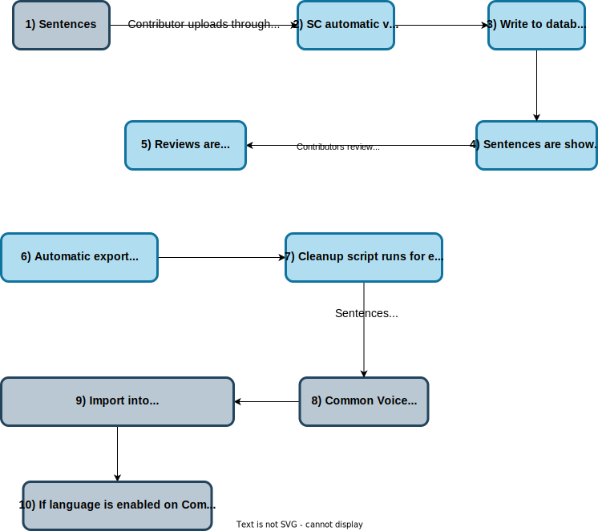
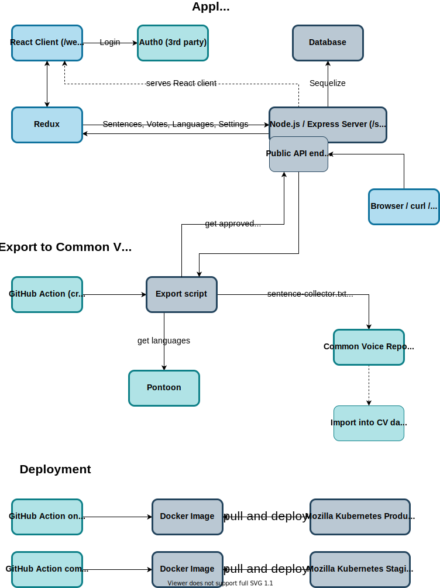

THe Sentence Collector is now integrated into the main [Common Voice website](https://commonvoice.mozilla.org/write). The GitHub repository can be found [here](https://github.com/common-voice/common-voice/). Therefore this project is archived. Note that there is no maintenance and security vulnerabilities will not get fixed. Do not run this yourself in production without forking and maintaining it.

# Archived: Common Voice Sentence Collector

The [Sentence Collector](https://commonvoice.mozilla.org/sentence-collector/) is part of the [Common Voice](https://commonvoice.mozilla.org/) project. Its purpose is to provide a tool for contributors to upload public domain sentences, which then can get reviewed and are exported to the Common Voice database. Once imported into the Common Voice website, they will show up for contributors to read out aloud.

For uploads of thousands of sentences, Sentence Collector is not the best tool. Check out the [Bulk Submission](https://github.com/common-voice/common-voice/blob/main/docs/SENTENCES.md#bulk-submission) guidelines for this use case. Another tool is the [Sentence Extractor](https://github.com/Common-Voice/cv-sentence-extractor) which allows automatic extraction of data sources such as Wikipedia.

## Detailed Flow

This explanation only focuses on the Sentence Collector.



*To edit this diagram, load the `flow.svg` in the docs of the repository into [diagrams.net](https://app.diagrams.net/) and then save the updated version back into the repository like any other file changes you'd make.*

In the diagram above, light blue squares represent Sentence Collector processes. The grey squares are processes outside of the Sentence Collector tooling. The grey processes are the same for other sentence sources, such as bulk submissions and Sentence Extractor. Instead of an automatic export, these use Pull Requests directly adding text files into the [`server/data` folder of the Common Voice website repository](https://github.com/common-voice/common-voice/tree/main/server/data).

1) Contributors gather sentences from public domain sources and (optionally) pre-process and pre-review them. These sentences can be from public domain books, or even self-written. The source does not matter, as long as the sentences are in the public domain. Contributors then upload these sentences through the [Sentence Collector "Add" form](https://commonvoice.mozilla.org/sentence-collector/#/add).
2) The Sentence Collector validates these sentences based on [rules per language](server/lib/validation/VALIDATION.md) (or the English rule file as default). Any sentence that does not match the validation rules does not get further processed and is shown as error in the Sentence Collector user interface for correction. For example, sentences are not allowed to have numbers in them, such as `2022`.
3) Any sentence that passed the validation gets written to the Sentence Collector database.
4) These sentences then get shown on the [Sentence Collector "Review" page](https://commonvoice.mozilla.org/sentence-collector/#/review) for other contributors to review.
5) Contributor's reviews are saved in the Sentence Collector database. Sentences can be approved or rejected. If at least 2 out of 3 reviews are positive, the sentence will eventually be exported for Common Voice (see the steps below).
6) Once a week an automatic process is triggered (GitHub action) to export all approved sentences to the Common Voice repository.
7) During this export, the [cleanup](https://github.com/common-voice/sentence-collector/blob/main/server/lib/cleanup/CLEANUP.md) scripts are run for each sentence, if configured for a language. This can be used to apply transformations for consistency, such as converting "..." into "…".
8) The resulting `sentence-collector.txt` file is written to the [language specific folder](https://github.com/common-voice/common-voice/tree/main/server/data) in the Common Voice repository. Note that any change to that file within the Common Voice repository will be overwritten by the next export, as the only source is the Sentence Collector database.
9) Sentences added to the Common Voice `server/data` folder do not instantly get imported Common Voice. This means that they are not instantly available for recording on the Common Voice website. The import of new sentences only happens when a new version of the Common Voice website is released. You can find the past releases [here](https://github.com/common-voice/common-voice/releases).
10) If a certain language is enabled for contribution, the imported sentences will then be shown to contributors to record.

## Get involved

- Fork the project and test that you can run the environment locally following the instructions below.
- Is everything working as expected? If not, submit [a new issue](https://github.com/Common-Voice/sentence-collector/issues/new).
- Review the pending issues in the [project](https://github.com/Common-Voice/sentence-collector/projects/2).
- Create a [new PR](https://github.com/Common-Voice/sentence-collector/compare) to fix any of the existing issues in the project.
- To add or adjust normalization, validation and cleanup for a language see [VALIDATION.md](https://github.com/common-voice/sentence-collector/blob/main/server/lib/validation/VALIDATION.md) and [CLEANUP.md](https://github.com/common-voice/sentence-collector/blob/main/server/lib/cleanup/CLEANUP.md). Cleanup is optional and should only be used in rare cases.

## Prerequisites

- [Node >= 12.0.0](https://nodejs.org/en/)
- [docker](https://docs.docker.com/install/)
- [docker-compose](https://docs.docker.com/compose/install/)
- [prettier](https://prettier.io/) - automatically formats the code as it should be in this project, there are also several IDE plugins for it

## Architecture



*To edit this diagram, load the `architecture.svg` in the docs of the repository into [diagrams.net](https://app.diagrams.net/) and then save the updated version back into the repository like any other file changes you'd make.*

## Local Development

Start the MySQL database:

```bash
docker-compose up
```

Now we can install the dependencies:

```bash
npm run install:all
```

Start the server in a new terminal window. For this you'll need parameters from Auth0 to make sure that the login works, see below for a short tutorial.

```bash
cd server
npm run db:migrate
env AUTH0_DOMAIN=yourusername.eu.auth0.com AUTH0_CLIENT_ID=fromauth0 AUTH0_CLIENT_SECRET=fromauth0 SESSION_SECRET=somerandomvalue npm start
```

Finally, you can start the frontend in another terminal window. Please make sure that you're in the root directory of the repository.

```bash
cd web
npm start
```

The sentence collector is now accessible through `http://localhost:3333`. We're serving the frontend code through the NodeJS app to make Auth0 work locally. However the frontend code changes are still rebuilt, so you can reload the tab to see changes.

### Seed

If you want to fill up your local database with a lot of sentences and votes, you can run the following script. This command will run for a long time, as it creates millions of entries in the database. For normal development this might not be necessary, however this can be very useful for performance measurements.

```bash
npm run db:seed
```

However note that this only works on a freshly created database for now, to keep the complexity with foreign keys low. If somebody wants to adjust the seed script to be more dynamic and not rely on hardcoded keys, we are happy to accept a PR for this.

### Working with localizations / languages

We are using the same languages as Common Voice is. Therefore we rely on the information Common Voice stores in its repository. The `locales` JSON files in this repo only contain example data. These files get updated when deploying Sentence Collector.

If you want to have all the translations available locally, you can run `npm run pull-cv-translations` in the root folder. **Note that even after pulling this information, not all strings will be translated.** We are not fetching the complete English translation file, therefore the language selection on development will be broken. This is not perfect, but for now expected behavior. This is a drawback of the current infrastructure, as we do not want the complete English translation file from Common Voice, as we keep the Sentence Collector EN FTL strings under version control. We do not want to risk to push the CV strings twice, therefore we do not touch the English file. If you want to test it, use a different UI language after running `npm run pull-cv-translations`.

## Getting required parameters from Auth0

1. Create an [Auth0](https://auth0.com/) account. There is a free tier and that will be enough for local development.
2. Click "Applications" from the dashboard. Create a new one, or use the default application.
3. Go to "Applications" and click on the Settings icon next to your application.
4. Add `http://localhost:3333/sentence-collector/callback` to the "Allowed Callback URLs" list.
5. You can add more login options to your app from the "Connections" tab, but you don't have to
6. These required domain, client ID and client secret are found in the same Settings tab as the "Allowed Callback URLs". Copy those into your run command from above.
7. You will now be able to create a new user by clicking on "Login" and then switching over to the "Sign Up" tab on the login dialog. You don't need to use a valid email address.

## Running automated tests

### Backend

Running the unit and integration tests:

```bash
cd server
npm t
```

### Frontend

Running the unit tests:

```bash
cd web
npm t
```

If you need to update the snapshots, run `npm t -- -u`, but make sure that the new snapshots indeed match the expected outcome.

## Path special cases

- In production the app is mounted at `/sentence-collector`
- Therefore we need to make sure that we're not requesting resources on `/`
- This however leads to a weirder case locally, as we're faking this relationship.
- We do not want to build the base path into the image, which does not leave us many possibilities. Injecting it into the running container is a possibility, but makes it quite complicated for the frontend calls.
- Therefore we are serving the frontend on `/` locally, and the API lives at `/sentence-collector`
- With that we have the same relative calls as we have in production
- Apart from having a prefix that is either empty or not, we do not have any other special casing

## Sentence Export to Common Voice

You don't need to manually export the sentences from the Sentence Collector to the Common Voice repository. This is done automatically once a week: https://github.com/common-voice/sentence-collector/actions?query=workflow%3Aexport

## Localization Process

The localization for the Sentence Collector happens in the Common Voice project. You can learn more about that in the [LOCALIZATION](https://github.com/common-voice/sentence-collector/blob/main/docs/LOCALIZATION.md) documentation.

## Useful queries

### Get all approved sentences

```sql
SELECT
      Sentences.id,
      Sentences.sentence,
      Sentences.localeId,
      SUM(Votes.approval) as number_of_approving_votes
    FROM Sentences
    LEFT JOIN Votes ON (Votes.sentenceId=Sentences.id)
    GROUP BY Sentences.id
    HAVING
      number_of_approving_votes >= 2;
```

### Get not decided sentences

```sql
SELECT
      Sentences.id,
      Sentences.sentence,
      Sentences.localeId,
      SUM(Votes.approval) as number_of_approving_votes,
      COUNT(Votes.approval) as number_of_votes
    FROM Sentences
    LEFT JOIN Votes ON (Votes.sentenceId=Sentences.id)
    GROUP BY Sentences.id
    HAVING
      number_of_votes < 2 OR # not enough votes yet
      number_of_votes = 2 AND number_of_approving_votes = 1; # a tie at one each
```

### Get all decided

```sql
SELECT Sentences.*
    FROM Sentences
    LEFT JOIN Votes ON (Votes.sentenceId=Sentences.id)
    GROUP BY Sentences.id
    HAVING
      COUNT(Votes.approval) >= 2;
```

### Get all rejected

```sql
SELECT Sentences.*
    FROM Sentences
    LEFT JOIN Votes ON (Votes.sentenceId=Sentences.id)
    GROUP BY Sentences.id
    HAVING
      (
        COUNT(Votes.approval) = 3 AND
        SUM(Votes.approval) < 2
      ) OR (
        COUNT(Votes.approval) = 2 AND
        SUM(Votes.approval) = 0
      );
```

## API

You can find the API documentation for the public endpoints in the [OpenAPI spec](https://commonvoice.mozilla.org/sentence-collector/api/).
