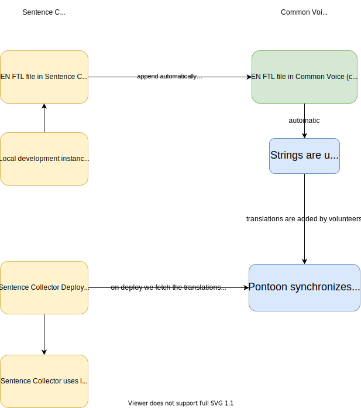

# Localization Process

Usually localization for different languages for a project would happen within the same project. As the Sentence Collector is part of Common Voice, but lives in its own repository, this process gets a bit more complicated. All the localization happens in the [Common Voice Pontoon project](https://pontoon.mozilla.org/projects/common-voice/).

To edit this diagram, load the `localization.svg` in the docs of the repository into [diagrams.net](https://app.diagrams.net/) and then save the updated version back into the repository like any other file changes you'd make.

## Local development

For local development you don't need to take any special steps. The main source file lives in this folder in the repo.

### Adding a new string

When adding a new string, you can add it to the `messages.ftl` file in this repository's `locales` web folder and use the `fluent` infrastructure we already have in place. For a good example on how to add a string, check out the content of the `home.tsx` component. After the next automatic export the new string will show up in Pontoon to be localized.

### Changing a string

When changing an existing string, there are two options:

- If the change of the string is minimal and does not require any re-translation in other languages (such as a small typo fix), you can simply change it in the English file.
- If the string needs to be retranslated in all languages, please rename the string ID as well. This then gets treated as a new string and localizers can re-translate it in Pontoon.

### Deleting a string

When deleting a string, remove it from the `messages.ftl` file and you're done. On the next export the string will be deleted from Pontoon.

## Localizing this project

To localize the Sentence Collector, head over to the [Common Voice Pontoon project](https://pontoon.mozilla.org/projects/common-voice/). There you can also see already existing translations. Translations also get exported to the [Common Voice repository](https://github.com/common-voice/common-voice/tree/main/web/locales).

## When do string changes show up on Pontoon?

Changes to strings show up in Pontoon after every automatic export. This currently happens every Wednesday. If we ever need to export new strings more often to get faster translations, we can re-evaluate a faster approach, such as exporting after every merge of a Pull Request. For now we don't expect many changes and do not have any urgency in getting strings translated.

## How does deployment work?

On every deployment of the Sentence Collector we're fetching the translations from the Common Voice repository and build them into the deployment artifact. This happens automatically and is nothing you need to worry about when implementing new features or changes to Sentence Collector. This approach is preferable to directly using the FTL file from the Common Voice website, as the URL might change and break the Sentence Collector.
